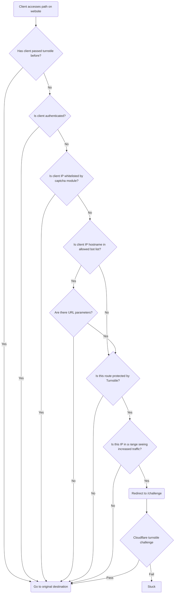

Our [Islandora](https://islandora.ca) repository, [The Lehigh Preserve](https://preserve.lehigh.edu), was being aggressively crawled by distributed bots on a fairly regular basis. To prevent these bots from increasing the load on our server we implemented a Drupal module [drupal/turnstile_protect](https://www.drupal.org/project/turnstile_protect) to prevent these bots from hitting computationally expensive pages on our site; namely our search index.

## The problem

Bots crawling a website is not a new phenomenon. Typically bots identify themselves with a user agent that contains some string that signals where the request is coming from. Unfortunately the bot traffic we were seeing were not being good internet citizens. Instead, these bad bots spoofed their user agent to look like normal web browser traffic. This prevented a commonly used bot mitigation technique of blocking traffic based on the user agent. These bad bot user agents had no unique pattern, so the user agent pattern we would have blocked would certainly have included legitimate traffic.

To make matters worse, these bots were coming from large swaths of network addresses. Less we started adding hundreds of thousands of IP addresses to our firewall, we could not block traffic this way either. And again, we risked blocking legitimate traffic that happen to fall within the IP ranges we would have been blocking if we took that route.

## The solution: capture bot traffic with a captcha

Drupal has a solution to prevent bots from spamming form submissions using [drupal/captcha](https://www.drupal.org/project/captcha). So we thought: instead of protecting forms, what if we protected pages with the same sort of challenge?

### Cloudflare Turnstile

We wanted the solution that traps bad bots to have the least amount of disruption to our normal site visitors. Cloudflare offers an alternative to the common checkbox captcha. They call this captcha replacement [Cloudflare's Turnstile](https://www.cloudflare.com/products/turnstile/). With a turnstile widget, the challenge only asks the user to interact if Cloudflare is unable to automatically detect whether the site visitor is legitimate or not. This means most of the time when site visitors see this challenge, the widget goes away on its own and the visitor continues their web journey with no disruption. Worst case, they have to click a checkbox before proceeding. A normal challenge may look like this:

### When to challenge

Even with this seamless challenge experience, we wanted to be careful to only present a challenge when we have to. We only challenge a site visitor if their IP is coming from a range that is seeing increased traffic. Even then, the challenge is only presented once per session, and only if they're accessing a route we're explicitly protecting. We never challenge visitors coming from our campus network. Some of the routes we want to protect we also want indexed by good bots following the rules, so we also have a list of bots we let pass through unchallenged if they're identifying themselves as expected. Here is a diagram detailing how the system decides when to present a challenge to the client:

## Attribution

Huge thanks to Cloudflare for providing this terrific captcha replacement for free.

Also thanks to both the [drupal/turnstile](https://www.drupal.org/project/turnstile) and [drupal/captcha](https://www.drupal.org/project/captcha) modules we used as the basis for this module.
