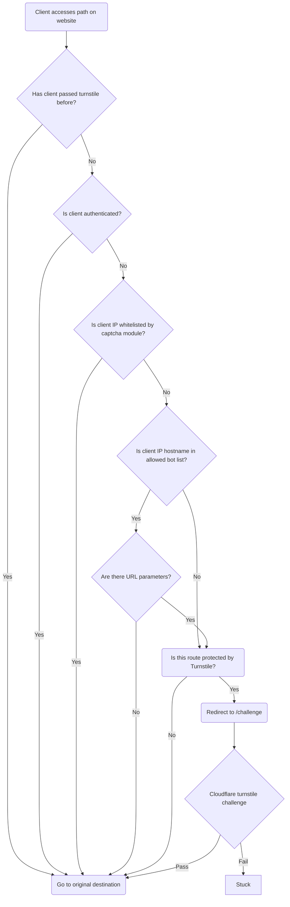

Our [Islandora](https://islandora.ca) repository, [The Lehigh Preserve](https://preserve.lehigh.edu), was suffering from distributed bots crawling our site and not respecting our robots.txt rules. So we implemented a Drupal module [drupal/turnstile_protect](https://www.drupal.org/project/turnstile_protect) to protect our website from being abused by these bots.

## The problem

Bots crawling a website is not a new phenomenon. Typically bots identify themselves with a user agent containing some identifying information about what institution is responsible for making the request. The traffic we were seeing were not being good internet citizens. Instead, they spoofed their user agent to look like normal web browser traffic. This prevented the commonly used method of blocking malicious traffic based on the user agent. The user agents had no unique pattern, and the set we would have had to block would certainly include site visitors we welcome to our site.

To make matters worse, these bots were coming from large swaths of network addresses. Less we started adding hundreds of thousands of IP addresses to our firewall, we could not block traffic this way either. And again, we risked blocking legitimate traffic that happen to fall within the IP ranges we would have been blocking if we took that route.

## The solution: capture bot traffic with a captcha

Drupal has a solution to prevent bots from spamming form submissions using [drupal/captcha](https://www.drupal.org/project/captcha). So we thought: instead of protecting forms, what if we protected pages with the same challenge?

### Cloudflare Turnstile

We wanted the challenge to trap bad bots to have the least amount of disruption to our normal site visitors. Cloudflare offers an alternative to the common checkbox captcha. [Cloudflare's Turnstile](https://www.cloudflare.com/products/turnstile/) challenge only asks the user to interact with the widget if Cloudflare is unable to automatically detect whether the site visitor is legitimate or not. This means most of the time when site visitors see this widget, the challenge goes away on its own and the visitor continues their web journey with no disruption. Worst case, they have to click a checkbox before proceeding.

### When to challenge

Still, we want to be careful to only present a challenge when we have to. We only challenge a site visitor once per session, and only if they're accessing a route we're explicitly protecting. We never challenge visitors coming from our campus network. Some of the routes we want to protect we also want indexed by good bots following the rules, so we also have a list of bots we let pass through unchallenged if they're identifying themselves as expected. Here is a diagram detailing how the system decides when to present a challenge to the client:

## Attribution

Huge thanks to Cloudflare for providing this terrific captcha replacement for free.

Also thanks to both the [drupal/turnstile](https://www.drupal.org/project/turnstile) and [drupal/captcha](https://www.drupal.org/project/captcha) modules we used as the basis for this module.
