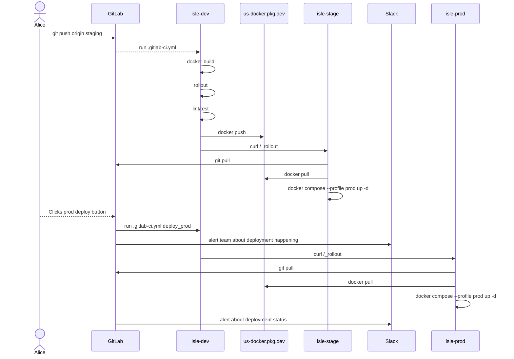

Our [Islandora](https://islandora.ca) repository, [The Lehigh Preserve](https://preserve.lehigh.edu), utilizes [GitLab CI/CD](https://docs.gitlab.com/ee/ci/) to automate the testing and deployment of code changes to our repository. Some reasons why we did this:

- **Reduce toil** around getting changes from a developer's laptop into the production environment
- **Add push safety** to ensure new changes won't introduce breaking changes to existing features
- **Document** deployment intricacies in code, rather than a developer or administrator's 📝 and/or 🧠
  <ul><li>Any changes to the deployment process are made in the code. This avoids introducing drift that might occur if the process is instead documented outside the codebase.</li></ul>

## Overview

The basic deployment workflow looks like:

1. A developer is running our fork of [isle-site-template](https://github.com/islandora-devops/isle-site-template) locally and making development changes and/or updating dependencies
2. The local changes are pushed to the GitLab instance Lehigh's Systems Engineering Team manages
3. The code changes are rolled out to our development server
    <ol type="a">
        <li>This simple step ensures no major breaking changes (e.g. a simple php syntax error causing a WSOD)</li>
        <li>A code linter is then ran on our codebase</li>
        <li>Then phpunit tests for our custom features (e.g. in [lehigh_islandora](https://github.com/lehigh-university-libraries/lehigh_islandora/tree/main/tests/src)) help ensure no regressions.</li>
    </ol>
4. Everything passes, the docker build is pushed to our Google Artifact Registry docker repository
5. That new docker tag is deployed to our staging server, which is a mirror of our production instance
6. Developer and/or repository team can review changes on staging
7. Developer can click the "deploy to prod" button in GitLab to send the changes to production
8. Slack message goes out to repository team about the deployment process

Any failure in any of those steps halts the workflow from continuing to the next step.

Here's what that looks like visually:



## ISLE Site Template additions

We had to add a few new services to our ISLE site template YAML to help with this process.

### Selenium

Our dev server runs selenium to allow for functional javascript tests

```yaml
    selenium-dev: &selenium
        <<: [*dev, *common]
        # once https://github.com/minkphp/MinkSelenium2Driver supports selenium 4
        # we can get newer browser support
        image: selenium/standalone-firefox:3.141
        networks:
            default:
                aliases:
                    - selenium
```

### Rollout

We created a special [rollout http service](https://github.com/lehigh-university-libraries/rollout) to allow triggering rollouts in our CI/CD. The rollout service allows triggering rollout operations via an HTTP call, instead of stuffing SSH credentials in our CI pipeline for a user with privileged enough access to perform deployments. The service uses the OIDC auth from our GitLab server to authenticate to ensure only our GitLab pipeline can trigger a rollout. Our prod config for the service looks like


```yaml
    rollout-prod: &rollout-prod
        <<: [*prod, *common]
        image: us-docker.pkg.dev/${GCLOUD_PROJECT}/internal/rollout:main
        labels:
            traefik.enable: true
            traefik.http.routers.rollout.entrypoints: https
            traefik.http.routers.rollout.rule: Host(`${DOMAIN}`) && PathPrefix(`/_rollout`)
            traefik.http.routers.rollout.tls.certresolver: *traefik-certresolver
            traefik.http.routers.rollout.tls: true
            traefik.http.services.rollout.loadbalancer.server.port: 8080
            traefik.http.routers.rollout.middlewares: rollout-ip
            traefik.http.middlewares.rollout-ip.ipwhitelist.sourcerange: ${TRUSTED_IPS}
            traefik.http.middlewares.rollout-ip.ipwhitelist.ipstrategy.depth: ${ROLLOUT_DEPTH}
        volumes:
          # to let rollout git pull the codebase
          - /opt/islandora/d10_lehigh_agile:/opt/islandora/d10_lehigh_agile
          # for the rollout service to call the bash script
          - /opt/islandora/d10_lehigh_agile/scripts/maintenance/rollout.sh:/rollout.sh
          # give SSH identity to allow git pull
          - /home/rollout/.ssh:/root/.ssh
          # pass in the .gitconfig for any overrides we need
          - /home/rollout/.gitconfig:/root/.gitconfig
          # need to pass the docker identity to allow git pull from our private registry
          - /home/rollout/.docker:/root/.docker
          # need access to the docker daemon to run docker composer and docker pull
          - /var/run/docker.sock:/var/run/docker.sock
        environment:
            DOCKER_HOST: unix:///var/run/docker.sock
            # dev/stage/prod server hostname
            # used in rollout script to perform certain actions depending on environment
            HOST: $HOST
            DOMAIN: $DOMAIN
            # used for the rollout service auth
            JWKS_URI: https://${GITLAB_DOMAIN}/oauth/discovery/keys
            JWT_AUD: $HOST
            CUSTOM_CLAIMS: '{"project_path": "lts-library/i2", "ref": "staging"}'
            # for our reverse proxy setup
            ROLLOUT_DEPTH: ${ROLLOUT_DEPTH}
```

## CI Pipeline

With those two new services, it was a matter of building our CI pipeline using GitLab's `.gitlab-ci.yml` YAML syntax. First we defined the workflow stages. We also added an option to cancel any running workflows if a new git push comes in while a workflow is running.

```yaml
workflow:
  auto_cancel:
    on_new_commit: interruptible

stages:
  - build-lint-test
  - push
  - deploy
  - cleanup
```

The first build/lint/test step defined as

```yaml
build-lint-test:
  interruptible: true
  stage: build-lint-test
  id_tokens:
    ID_TOKEN_1:
      aud: dev
  variables:
    ROLLOUT_URL: https://isle-dev/_rollout
  script:
    - echo "$GCLOUD_KEY" | docker login -u _json_key_base64 --password-stdin https://us-docker.pkg.dev
    - ./scripts/ci/build.sh
    - ./scripts/ci/trigger-rollout.sh
    - ./scripts/ci/lint.sh
    - ./scripts/ci/test.sh
  tags:
    - isle
```

That step runs on our development server. After that step passes, the docker tag is pushed

```yaml
push:
  interruptible: true
  stage: push
  dependencies:
    - build-lint-test
  script:
    - docker push us-docker.pkg.dev/${GCLOUD_PROJECT}/isle/drupal:${CI_COMMIT_BRANCH}-${CI_COMMIT_SHORT_SHA}
    - docker push us-docker.pkg.dev/${GCLOUD_PROJECT}/isle/drupal:${CI_COMMIT_BRANCH}
  tags:
    - isle
```

Assumming the push succeeds, the docker image is deployed to our staging server

```yaml
deploy_stage:
  stage: deploy
  dependencies:
    - push
  id_tokens:
    ID_TOKEN_1:
      aud: islandora-test
  variables:
    ROLLOUT_URL: https://isle-stage/_rollout
  script:
    - ./scripts/ci/trigger-rollout.sh
  rules:
    - if: $CI_COMMIT_BRANCH == $CI_DEFAULT_BRANCH
  tags:
    - isle
```

And finally, we have a manual step to optionally deploy to production.

```yaml
deploy_prod:
  stage: deploy
  dependencies:
    - deploy_stage
  id_tokens:
    ID_TOKEN_1:
      aud: islandora-prod
  variables:
    ROLLOUT_URL: https://isle-prod/_rollout
  script:
    - ./scripts/ci/trigger-rollout.sh
  when: manual
  rules:
    - if: $CI_COMMIT_BRANCH == $CI_DEFAULT_BRANCH
  tags:
    - isle
```

## On php tests

We opted to use [drupal/dtt](https://www.drupal.org/project/dtt) to base our tests on. This allows us to just utilize our always on dev server, which is running our production site config and content, to run our tests on using that site. We found a problem with self signed CA certificates causing issues between functional/unit tests and functional javascript tests, so until we resolve that issue we just run two different php unit jobs:

```bash
#!/usr/bin/env bash

set -eou pipefail

SCRIPT_DIR=$( cd -- "$( dirname -- "${BASH_SOURCE[0]}" )" &> /dev/null && pwd )
. "${SCRIPT_DIR}"/init.sh

docker exec \
  "$ISLE_PHP_FPM" \
  su nginx -s /bin/bash -c "php vendor/bin/phpunit \
    -c phpunit.unit.xml \
    --debug \
    --verbose"

docker exec \
  "$ISLE_PHP_FPM" \
  su nginx -s /bin/bash -c "DTT_BASE_URL='http://drupal' php vendor/bin/phpunit \
    -c phpunit.selenium.xml \
    --debug \
    --verbose"
```

The two files look the same:

```xml
<?xml version="1.0" encoding="UTF-8"?>
<phpunit bootstrap="vendor/weitzman/drupal-test-traits/src/bootstrap-fast.php">
    <php>
        <env name="DTT_BASE_URL" value=""/>
        <env name="DTT_MINK_DRIVER_ARGS" value='["firefox", null, "http://selenium:4444/wd/hub"]'/>
        <env name="SYMFONY_DEPRECATIONS_HELPER" value="disabled"/>
        <env name="BROWSERTEST_OUTPUT_DIRECTORY" value="/tmp"/>
        <env name="DTT_SCREENSHOT_REPORT_DIRECTORY" value="/tmp"/>
        <env name="DTT_HTML_OUTPUT_DIRECTORY" value="/tmp"/>
    </php>
```

but one runs our functional/unit tests

```xml
    <testsuites>
        <testsuite name="existing-site">
            <directory>./web/modules/contrib/lehigh_islandora/tests/src/ExistingSite</directory>
        </testsuite>
    </testsuites>
</phpunit>
```

and the other runs our functional javascript tests

```xml
    <testsuites>
        <testsuite name="existing-site">
            <directory>./web/modules/contrib/lehigh_islandora/tests/src/ExistingSiteJavascript</directory>
        </testsuite>
    </testsuites>
</phpunit>
```

You can see some of our tests at [https://github.com/lehigh-university-libraries/lehigh_islandora/tree/main/tests/src](https://github.com/lehigh-university-libraries/lehigh_islandora/tree/main/tests/src)

## Future improvements

We've been using this pipeline as describe for about seven months with little to no after it was initially implemented. The only thing we'd like more of are more phpunit tests to ensure better push safety.

We also hope to eventually encapsulate this using something like [dagger.io](https://dagger.io/) so the pipeline could be shared and used by any CI/CD system (e.g. GitHub).
